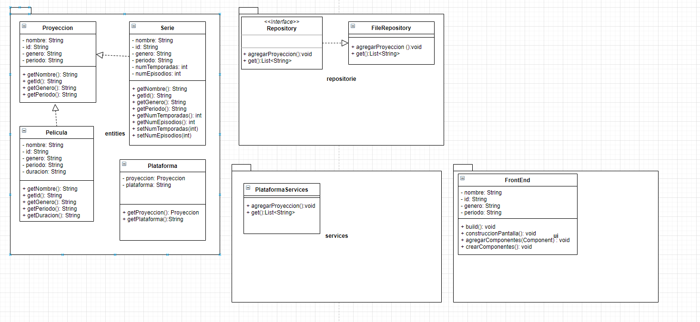

# Proyecto

Descripción:
El sistema almacena los datos que se requieren para las diferentes proyecciones en un archivo txt llamado
ListaProyecciones, ya sean películas o series y además de eso lo despliega en consola.

Requerimientos mínimos para correr la aplicación:
Tener un IDE instalado en el cual funcione el lenguaje java ( recomendado IntelliJ).

Problema que resuelve:
El problema que resuelve es donde poder almacenar la lista de proyecciones.

